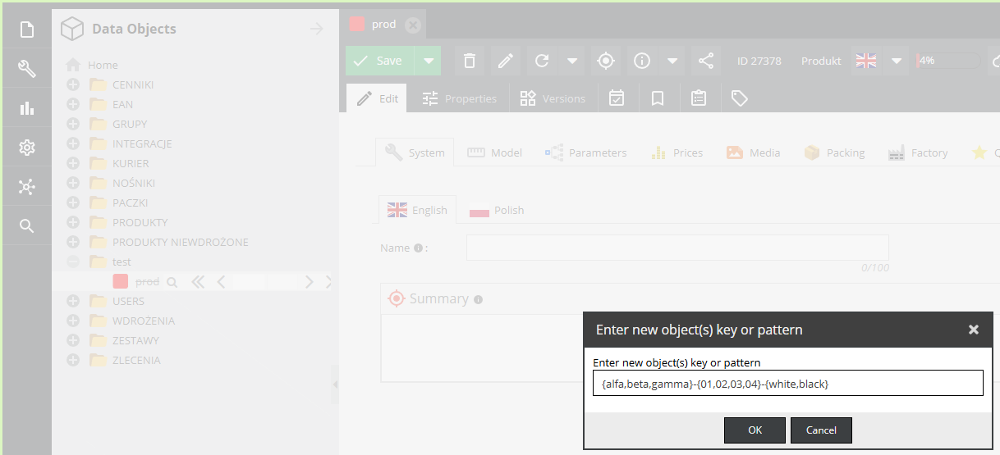
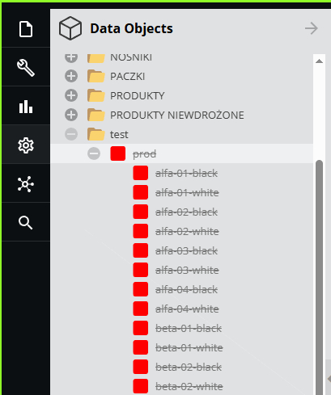

Oprócz domyślnych skrótów klawiszowych dostarczonych przez pimcore definiuje się skróty dodatkowe:

## ```ctrl``` + ```m``` - dodawanie obiektów dzieci

Dodaje dzieci dla aktualnie otwartego obiektu. 

Obsługuje uproszoczne [brace expansion](https://www.gnu.org/software/bash/manual/html_node/Brace-Expansion.html), czyli 
generowanie wszystkich kombinacji podzbiorów zadanego ciągu.

Przykładowo, wprowadzony ciąg ```{alfa,beta,gamma}-{01,02,03,04}-{white,black}```



Zostaje rozwinięty do 24 kombinacji kodów obietków (3 * 4 * 2) 

