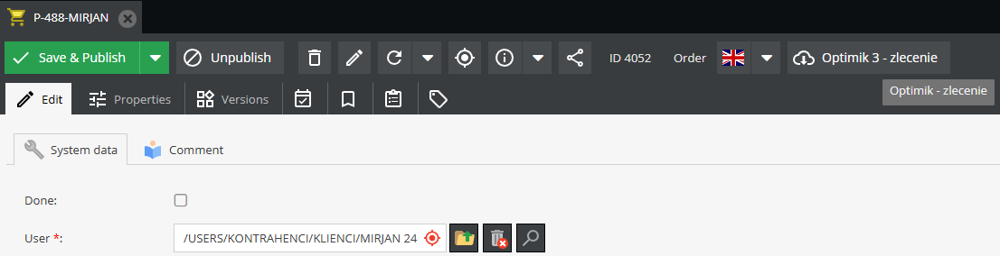
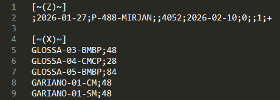

## Eksport zleceń (.csv dla Optimik)

Dla wybranej serii w partii produkcyjnej możliwe jest wygenerowanie w panelu admina pliku (.csv) uproszczonego importu, 
na który składają się:

- bieżąca data - data dodania zlecenia
- bieżaca data przesunięta o 2 tygodnie w przód - jako domyślny termin realizacji zlecenia
- lista produktów (key) oraz ich ilości

Formalnie, zgodnie z dokumentacją Optimik 3 taki eksport określa się jako Uproszczone dodawanie produktów do zlecenia.

Przykładowe wywołanie eksportu zlecenia

Skutukuje wygenerowaniem poniższej zawartości pliku

## Arkusze użyte w partii

Z poziomu harmonogramu możliwe jest pobranie informacji o arkuszach płyty użytych w ramach:
 
- całej partii (wiele zleceń)
- pojedyńczego zlecenia w partii
- pojedyńczego produktu w zleceniu w danej partii

Integracja jest zrealizowana poprzez komunikację z dedykowanym serwerem REST API dla Optimik 3. Z racji długiego czasu
generowania odpowiedzi z API dodano obsługę pamięci podręcznej z `ttl` na poziomie 24h.
