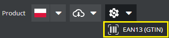

# Produkt (Product)

Towar, który można sprzedać. 

## Publikacja produktu

Publikacja produktu złożona jest z dwóch etapów - walidacji, czyli dodatkowego sprawdzenia danych
produktu oraz akcji, które zostaną wykonane po udanej walidacji

### Walidacja

1. Produkt musi posiadać nazwę przynajmniej w języku polskim
1. Paczki - wszystkie muszą być opublikowane
1. Paczki - muszą być przypisane w ilości większej niż ```0```

### Akcje

1. Tłumaczenie nazw na podstawie wprowadzonej nazwy polskiej
1. Sumowanie mas i objętości paczek

#### Akcje - tylko dla typu ```ACTUAL```

1. Dodawanie domyślnego kodu kreskowego
1. Wyznaczanie cen przesyłek kurierskich wg. parametrów paczek
1. Publikacja w RabbitMQ ```PRD:product``` - głównie w celu dodania do systemu ERP

### Dodatkowe funkcje

- Eksport zdjęć do archiwum .zip


- Nadawanie kodu EAN z pierwszej dostępnej puli ```EanPool```



